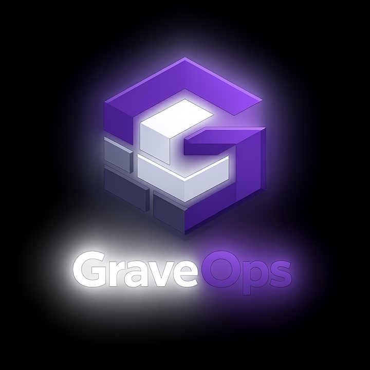

  

# GraveOps

GraveOps is a Windows desktop control center for managing and observing self-hosted media infrastructure.

## GraveOps 2.0 RC2

This release includes:

- provider-neutral backups as a first-class page and Dashboard module
- centralized action execution with elapsed-time and status reporting
- Linux storage filtering that suppresses pseudo-filesystem noise
- activity and fleet-history tracking
- application and service management surfaces
- Recyclarr discovery and **preview-only** execution
- close-to-tray lifecycle behavior
- source, installer, reinstall, uninstall, and recovery validation

## Install

Download `GraveOps-Setup-2.0-RC2.exe` from the GitHub Release for **v2.0.0-rc2**.

> The RC2 installer is currently unsigned. Windows SmartScreen may display a warning. Verify the SHA-256 checksum before running it.

### Final RC2 hashes

``text
Installer:
03726381B8D9AF078DF27091A398CAA8598C381802BA66D5F38B82A1C8EAFE2A

Published/installed GraveOps.exe:
CADDECCFDE3B4677A05D81F086ABE0F93B0D1C24AE7AAAF8F8013A72BC420D4A

Frozen source bootstrap:
820BCC235C3314D3BE54AF133625555F1999F2C5FDAD3B2C2B7DC39AD6E5A1AB

Embedded source payload:
9FE6070C1531D0BB6AA4238714F71B2C61B2AEC0B4071A1EFCF693D41C326C27
``

## Build from source

Requirements:

- Windows 10 or Windows 11, x64
- .NET SDK 10
- Inno Setup 6 to produce the installer

From PowerShell:

``powershell
Set-ExecutionPolicy -Scope Process Bypass -Force
.\build-release.ps1
``

The published application is created under `publish\win-x64`. When Inno Setup 6 is available, the installer is created under `dist`.

## Validation

The frozen RC2 was reconstructed from its embedded payload and then passed:

| Validation layer | Result |
|---|---:|
| Source/build/UI/lifecycle | 27 PASS, 0 WARN, 0 FAIL |
| Installer/install/reinstall | 13 PASS, 0 WARN, 0 FAIL |
| Uninstall/recovery | 14 PASS, 0 WARN, 0 FAIL |

Validation scripts are included in `release-tools`.

## Safety

Recyclarr is intentionally exposed as preview-only in RC2. No sync/write action is presented.

Do not commit exported profiles, credentials, private keys, API tokens, local `appsettings.Development.json` files, or files from `%APPDATA%\GraveOps`.

## License

MIT License. See [LICENSE](LICENSE).